# GitMaster - System Architecture

## 1. Architecture Overview

GitMaster follows a three-tier architecture with a React frontend, Node.js/Express backend, and external GitHub API integration. The system is designed for modularity, scalability, and maintainability.

### 1.1 High-Level Architecture

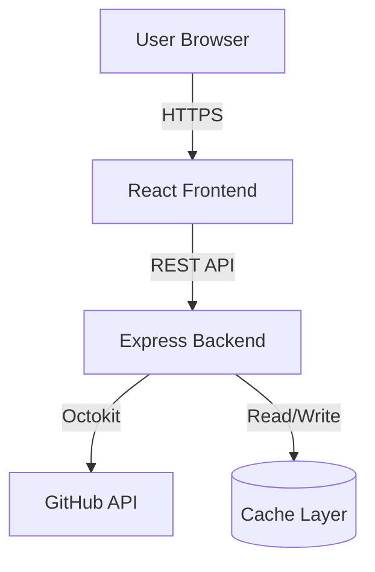

### 1.2 System Components

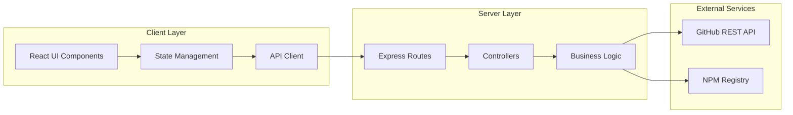

## 2. Backend Architecture

### 2.1 Layer Structure

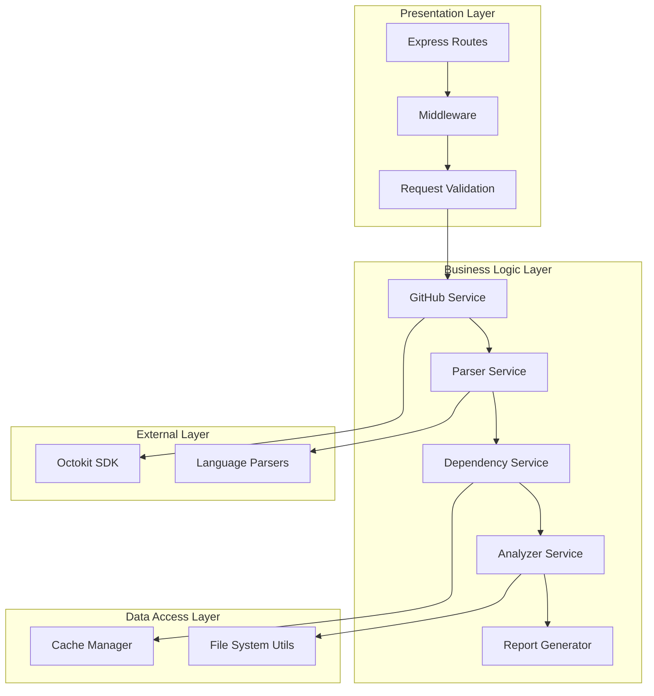

### 2.2 Service Components

#### GitHub Service
Handles all interactions with GitHub API:
- Fetch repository metadata
- Retrieve file tree
- Get file contents
- List branches
- Handle authentication

**Key Methods**:
- `getRepository(owner, repo, token?)`
- `getFileTree(owner, repo, branch)`
- `getFileContent(owner, repo, path)`
- `getBranches(owner, repo)`

#### Parser Service
Parses repository files and extracts information:
- Parse dependency manifests
- Extract README content
- Parse configuration files
- Calculate file statistics

**Key Methods**:
- `parsePackageJson(content)`
- `parsePyprojectToml(content)`
- `parseCargoToml(content)`
- `extractREADME(content)`
- `calculateLOC(content, language)`

#### Dependency Service
Analyzes project dependencies:
- Build dependency graph
- Check for vulnerabilities
- Identify outdated packages
- Calculate dependency metrics

**Key Methods**:
- `buildDependencyGraph(manifest)`
- `checkVulnerabilities(dependencies)`
- `findOutdated(dependencies)`
- `calculateMetrics(graph)`

#### Analyzer Service
Performs code analysis and pattern detection:
- Detect frameworks and libraries
- Identify design patterns
- Find entry points
- Extract API endpoints
- Map component relationships

**Key Methods**:
- `detectFrameworks(fileTree, dependencies)`
- `identifyPatterns(fileTree)`
- `findEntryPoints(fileTree, packageJson)`
- `extractAPIEndpoints(sourceFiles)`
- `analyzeImports(sourceFiles)`

#### Report Service
Generates comprehensive reports:
- Compile analysis results
- Format markdown reports
- Generate visualizations
- Calculate summary metrics

**Key Methods**:
- `generateReport(analysisData)`
- `formatMarkdown(report)`
- `generateJSON(report)`
- `generateHTML(report)`

### 2.3 Data Flow

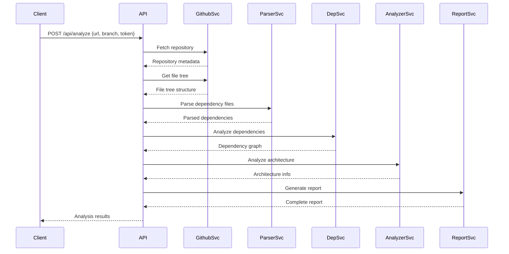

## 3. Frontend Architecture

### 3.1 Component Structure

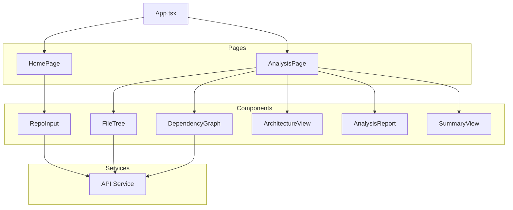

### 3.2 State Management

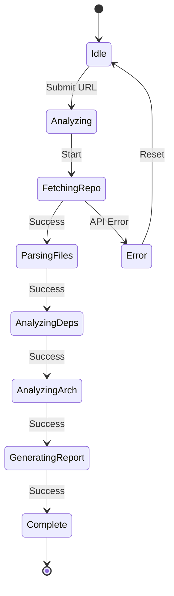

### 3.3 Key Frontend Components

#### RepoInput Component
- URL input field with validation
- Token input (optional, masked)
- Branch selector dropdown
- Submit button with loading state
- Recent analyses history

#### FileTree Component
- Hierarchical tree view
- Collapsible/expandable nodes
- File icons by type
- Search/filter functionality
- LOC and size display

#### DependencyGraph Component
- Interactive graph visualization (D3.js or vis.js)
- Node clustering by type
- Zoom and pan controls
- Dependency path highlighting
- Click to view dependency details

#### ArchitectureView Component
- Framework badges
- Design pattern cards
- Entry point list
- API endpoint table
- Component relationship diagram

#### AnalysisReport Component
- Markdown renderer
- Section navigation
- Export buttons (MD, JSON, HTML)
- Copy to clipboard
- Print view

## 4. API Architecture

### 4.1 REST Endpoints

#### POST /api/analyze
Initiates repository analysis
- **Input**: `{ url, branch?, token? }`
- **Output**: `{ analysisId, status }`

#### GET /api/analyze/:id
Retrieves analysis results
- **Input**: Analysis ID
- **Output**: Complete analysis data

#### GET /api/analyze/:id/progress
Gets analysis progress
- **Input**: Analysis ID
- **Output**: `{ stage, progress, eta }`

#### POST /api/analyze/:id/refresh
Forces re-analysis
- **Input**: Analysis ID
- **Output**: New analysis result

#### GET /api/health
Health check endpoint
- **Output**: `{ status, version, uptime }`

### 4.2 WebSocket Events (Optional Enhancement)
For real-time progress updates:
- `analysis:started`
- `analysis:progress`
- `analysis:completed`
- `analysis:error`

## 5. Technology Stack Details

### 5.1 Backend Technologies

| Technology | Purpose | Version |
|------------|---------|---------|
| Node.js | Runtime environment | 18.x+ |
| Express | Web framework | 4.x |
| TypeScript | Type safety | 5.x |
| Octokit | GitHub API client | Latest |
| @babel/parser | JavaScript AST parsing | Latest |
| typescript-parser | TypeScript analysis | Latest |
| toml | TOML file parsing | Latest |
| yaml | YAML file parsing | Latest |
| node-cache | In-memory caching | Latest |
| axios | HTTP client | Latest |
| zod | Schema validation | Latest |

### 5.2 Frontend Technologies

| Technology | Purpose | Version |
|------------|---------|---------|
| React | UI framework | 18.x |
| TypeScript | Type safety | 5.x |
| Vite | Build tool | 5.x |
| React Router | Routing | 6.x |
| TanStack Query | Data fetching | Latest |
| D3.js | Graph visualization | 7.x |
| Tailwind CSS | Styling | 3.x |
| React Markdown | Markdown rendering | Latest |
| Lucide React | Icons | Latest |

## 6. Design Patterns

### 6.1 Backend Patterns
- **Service Layer Pattern**: Business logic separated from routes
- **Dependency Injection**: Services injected into controllers
- **Factory Pattern**: Parser factory for different file types
- **Strategy Pattern**: Different analysis strategies per language
- **Observer Pattern**: Progress notifications

### 6.2 Frontend Patterns
- **Component Composition**: Reusable, composable components
- **Container/Presenter**: Smart and dumb components
- **Custom Hooks**: Reusable logic (useAnalysis, useFileTree)
- **Context API**: Shared state management

## 7. Security Architecture

### 7.1 Security Measures
- Input validation and sanitization
- Rate limiting on API endpoints
- CORS configuration
- Helmet.js for security headers
- Token encryption in transit
- No token persistence
- Content Security Policy

### 7.2 Data Flow Security

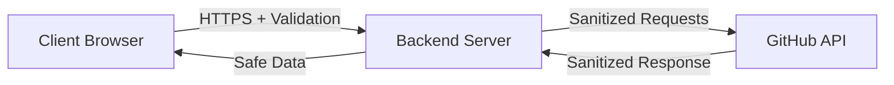

## 8. Error Handling Strategy

### 8.1 Error Types
- **Network Errors**: GitHub API unavailable, timeout
- **Authentication Errors**: Invalid token, insufficient permissions
- **Validation Errors**: Invalid URL, unsupported repository
- **Processing Errors**: Parser failure, unsupported language
- **Resource Errors**: Repository too large, rate limit exceeded

### 8.2 Error Recovery
- Automatic retry with exponential backoff (network errors)
- Graceful degradation (partial analysis on parser errors)
- Clear user feedback with actionable suggestions
- Detailed error logging for debugging

## 9. Caching Strategy

### 9.1 Cache Layers
- **Repository metadata**: 1 hour TTL
- **File tree**: 24 hours TTL
- **Dependency analysis**: 24 hours TTL
- **Full analysis**: 24 hours TTL

### 9.2 Cache Invalidation
- Manual refresh by user
- Automatic on TTL expiry
- Version-based (cache key includes commit SHA)

## 10. Scalability Considerations

### 10.1 Horizontal Scaling
- Stateless backend design
- No server-side session storage
- Cache can be moved to Redis
- Queue system for long-running analyses (Bull/BullMQ)

### 10.2 Optimization Strategies
- Lazy loading for large file trees
- Pagination for dependency lists
- Streaming for large file contents
- Background processing for heavy analysis
- CDN for static assets

## 11. Monitoring and Observability

### 11.1 Metrics to Track
- API response times
- Analysis completion rate
- Error rates by type
- GitHub API rate limit usage
- Cache hit/miss ratio
- User session duration

### 11.2 Logging
- Structured JSON logs
- Log levels: ERROR, WARN, INFO, DEBUG
- Request ID tracing
- Error stack traces
- Performance metrics

## 12. Development Workflow

### 12.1 Project Structure
- Monorepo with npm workspaces
- Shared TypeScript types
- Concurrent development (frontend + backend)
- Unified linting and formatting

### 12.2 Build and Deployment
- TypeScript compilation
- Frontend build with Vite
- Environment-based configuration
- Docker containerization (future)

## 13. Component Interaction Details

### 13.1 Analysis Pipeline

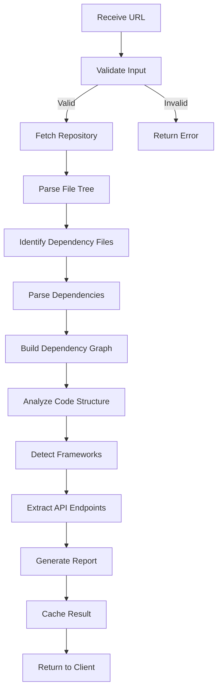

### 13.2 File Processing Flow

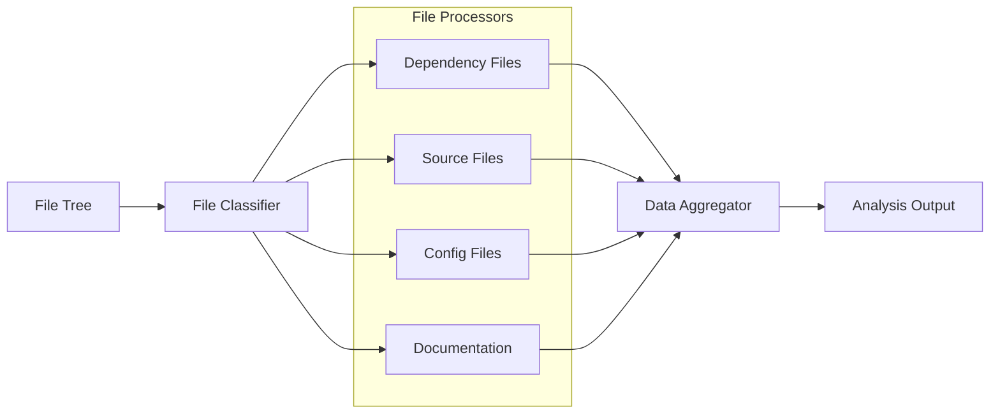

## 14. Database Schema (Future Enhancement)

While the initial version uses in-memory caching, future versions may use a database:

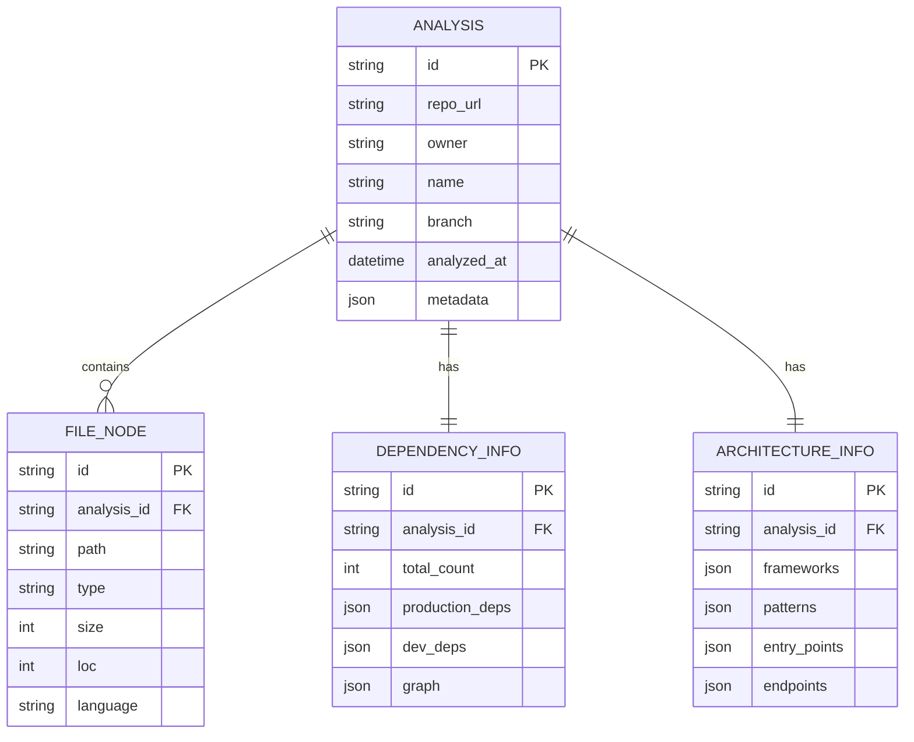

## 15. Directory Structure Conventions

### 15.1 Backend Directory Structure
```
backend/
├── src/
│   ├── config/           # Configuration files
│   ├── controllers/      # Request handlers
│   ├── services/         # Business logic
│   ├── models/           # Data models and types
│   ├── routes/           # API routes
│   ├── middleware/       # Express middleware
│   ├── utils/            # Helper functions
│   ├── validators/       # Input validation schemas
│   ├── types/            # TypeScript type definitions
│   └── server.ts         # Application entry point
├── tests/                # Test files
├── dist/                 # Compiled JavaScript (gitignored)
├── package.json
├── tsconfig.json
└── .env.example
```

### 15.2 Frontend Directory Structure
```
frontend/
├── src/
│   ├── components/       # React components
│   │   ├── common/       # Shared components
│   │   ├── analysis/     # Analysis-specific components
│   │   └── visualizations/ # Charts and graphs
│   ├── pages/            # Page components
│   ├── services/         # API clients
│   ├── hooks/            # Custom React hooks
│   ├── utils/            # Helper functions
│   ├── types/            # TypeScript types
│   ├── styles/           # Global styles
│   ├── App.tsx           # Root component
│   ├── main.tsx          # Entry point
│   └── vite-env.d.ts     # Vite types
├── public/               # Static assets
├── dist/                 # Build output (gitignored)
├── index.html
├── package.json
├── tsconfig.json
├── vite.config.ts
└── tailwind.config.js
```

## 16. API Response Formats

### 16.1 Standard Response Structure
```typescript
{
  success: boolean;
  data?: T;
  error?: {
    code: string;
    message: string;
    details?: any;
  };
  metadata?: {
    timestamp: string;
    requestId: string;
  };
}
```

### 16.2 Analysis Result Format
```typescript
{
  id: string;
  repository: {
    owner: string;
    name: string;
    url: string;
    branch: string;
    description: string;
    stars: number;
    forks: number;
    language: string;
    lastUpdated: string;
  };
  fileTree: FileNode[];
  statistics: {
    totalFiles: number;
    totalDirectories: number;
    totalLOC: number;
    languageDistribution: Record<string, number>;
    fileTypeDistribution: Record<string, number>;
  };
  dependencies: {
    manifestFiles: string[];
    totalCount: number;
    production: Dependency[];
    development: Dependency[];
    graph: DependencyGraph;
    vulnerabilities: Vulnerability[];
    outdated: OutdatedDependency[];
  };
  architecture: {
    frameworks: Framework[];
    patterns: string[];
    entryPoints: EntryPoint[];
    apiEndpoints: Endpoint[];
    importGraph: ImportGraph;
  };
  summary: {
    overview: string;
    keyFeatures: string[];
    techStack: string[];
    setupInstructions: string[];
    complexityScore: number;
  };
  report: {
    markdown: string;
    generatedAt: string;
  };
}
```

## 17. Performance Optimization

### 17.1 Backend Optimizations
- Stream large files instead of loading into memory
- Parallel processing of independent files
- Early termination for large repos (sample analysis)
- Connection pooling for GitHub API
- Gzip compression for API responses

### 17.2 Frontend Optimizations
- Code splitting by route
- Lazy loading of heavy components
- Virtual scrolling for large file trees
- Debounced search inputs
- Memoization of expensive computations
- Progressive rendering of analysis results

## 18. Testing Strategy

### 18.1 Backend Testing
- **Unit Tests**: Individual service methods
- **Integration Tests**: API endpoint flows
- **Mock Tests**: GitHub API responses
- **Performance Tests**: Large repository handling

### 18.2 Frontend Testing
- **Component Tests**: React Testing Library
- **E2E Tests**: Playwright or Cypress
- **Visual Regression**: Chromatic or Percy
- **Accessibility Tests**: axe-core

## 19. Deployment Architecture (Future)

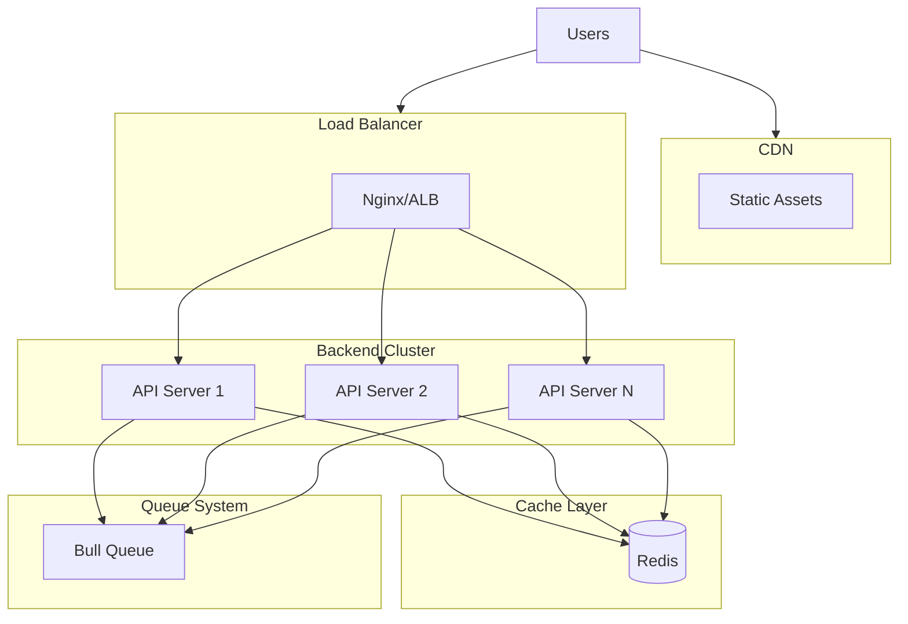

## 20. Future Enhancements

### 20.1 Phase 5 Features
- Real-time collaboration (multiple users analyzing same repo)
- Repository comparison tool
- Historical analysis tracking
- Automated dependency updates suggestions
- Code quality scoring integration
- CI/CD pipeline detection
- Docker configuration analysis

### 20.2 Advanced Analytics
- Machine learning for pattern detection
- Anomaly detection in dependencies
- Predictive maintenance suggestions
- Technical debt estimation
- Refactoring recommendations
