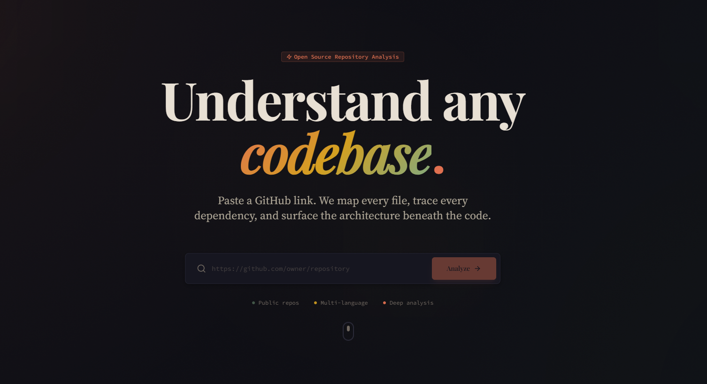

# GitMaster

> Deep GitHub Repository Analysis System

GitMaster is a web application that analyzes GitHub repositories and provides comprehensive insights into their structure, dependencies, and architecture.



## Features

- **Repository Analysis**: Fetch and analyze any public GitHub repository
- **File Tree Visualization**: Interactive hierarchical file structure
- **Dependency Extraction**: View all dependencies and devDependencies
- **Repository Insights**: Stars, forks, language, and metadata
- **Clean UI**: Terminal-inspired design with modern aesthetics

## Tech Stack

### Backend
- Node.js + Express
- TypeScript
- Octokit (GitHub API)

### Frontend
- React 18
- TypeScript
- Vite
- TailwindCSS
- TanStack Query

## Project Structure

```
gitmaster/
├── backend/          # Express API server
│   ├── src/
│   │   ├── routes/           # API routes
│   │   ├── services/         # Business logic
│   │   ├── types/            # TypeScript types
│   │   └── utils/            # Helper functions
│   └── package.json
├── frontend/         # React application
│   ├── src/
│   │   ├── components/       # React components
│   │   ├── services/         # API client
│   │   └── types/            # TypeScript types
│   └── package.json
└── docs/             # Project documentation
```

## Getting Started

### Prerequisites

- Node.js 18+ installed
- npm or yarn package manager

### Installation

1. Clone the repository:
```bash
git clone <repository-url>
cd gitmaster
```

2. Install backend dependencies:
```bash
cd backend
npm install
```

3. Install frontend dependencies:
```bash
cd ../frontend
npm install
```

### Running Locally

1. Start the backend server (from `backend/` directory):
```bash
npm run dev
```
The API will run on `http://localhost:3001`

2. In a new terminal, start the frontend (from `frontend/` directory):
```bash
npm run dev
```
The app will run on `http://localhost:5173`

3. Open your browser and navigate to `http://localhost:5173`

### Usage

1. Enter a GitHub repository URL (e.g., `https://github.com/facebook/react`)
2. Click **ANALYZE**
3. View the analysis results:
   - **Overview**: Repository metadata and summary
   - **File Tree**: Complete directory structure
   - **Dependencies**: All npm packages used

## API Endpoint

### POST /api/analyze

Analyzes a GitHub repository.

**Request:**
```json
{
  "url": "https://github.com/owner/repo"
}
```

**Response:**
```json
{
  "success": true,
  "data": {
    "repository": { ... },
    "fileTree": [ ... ],
    "dependencies": { ... },
    "summary": "...",
    "analyzedAt": "2026-02-24T..."
  }
}
```

## Deployment

### Vercel Deployment

The project is configured to work on Vercel out of the box.

**Backend:**
- Deploy as a serverless function
- Set environment variables in Vercel dashboard

**Frontend:**
- Automatic deployment from Git
- Update `VITE_API_URL` to point to backend URL

## Limitations (MVP)

- Only supports public repositories (no authentication)
- Only extracts npm dependencies (package.json)
- GitHub API rate limit: 60 requests/hour (unauthenticated)
- No caching or persistent storage

## Future Enhancements

- [ ] Support for private repositories with GitHub tokens
- [ ] Multi-language dependency support (Python, Rust, Go, Java)
- [ ] Dependency graph visualization
- [ ] Code complexity metrics
- [ ] Architecture pattern detection
- [ ] API endpoint extraction
- [ ] Caching layer for faster repeated analyses

## Documentation

Comprehensive documentation is available in the `docs/` folder:

- [Requirements](docs/requirements.md) - Functional and technical requirements
- [Architecture](docs/architecture.md) - System design and diagrams
- [API Specification](docs/api-specification.md) - Complete API reference
- [Tech Stack](docs/tech-stack.md) - Technology choices and rationale

## License

MIT

## Contributing

Contributions are welcome! Please feel free to submit issues and pull requests. 

## Thanks

Thanks to Cursor (Opus 4.6) The GOAT.
